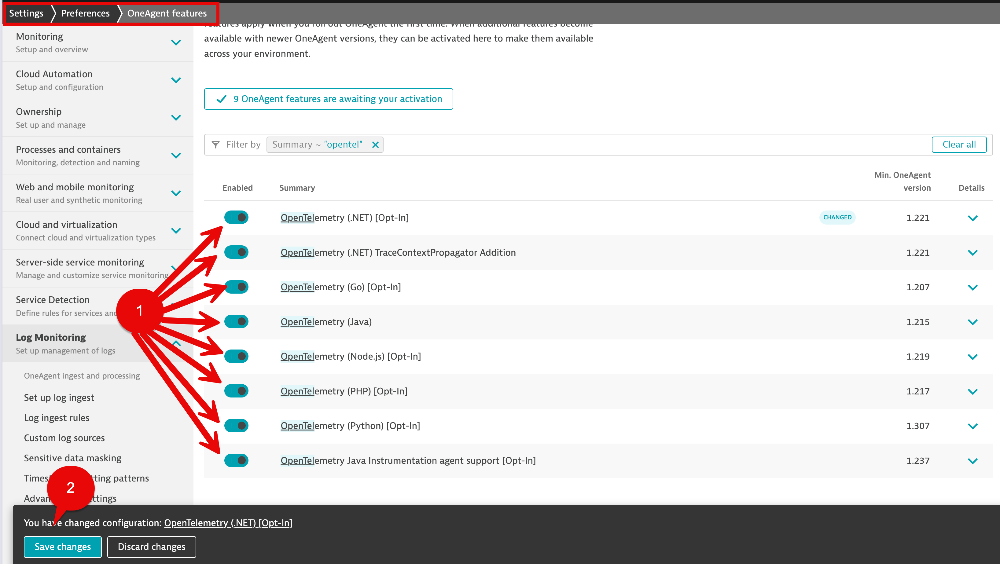
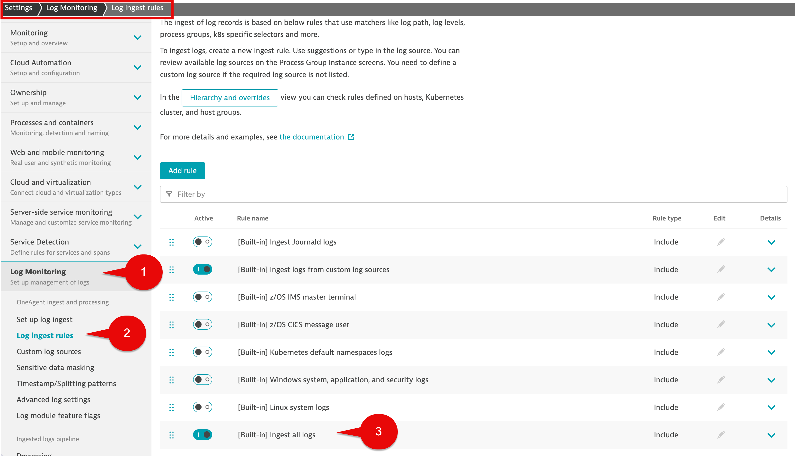
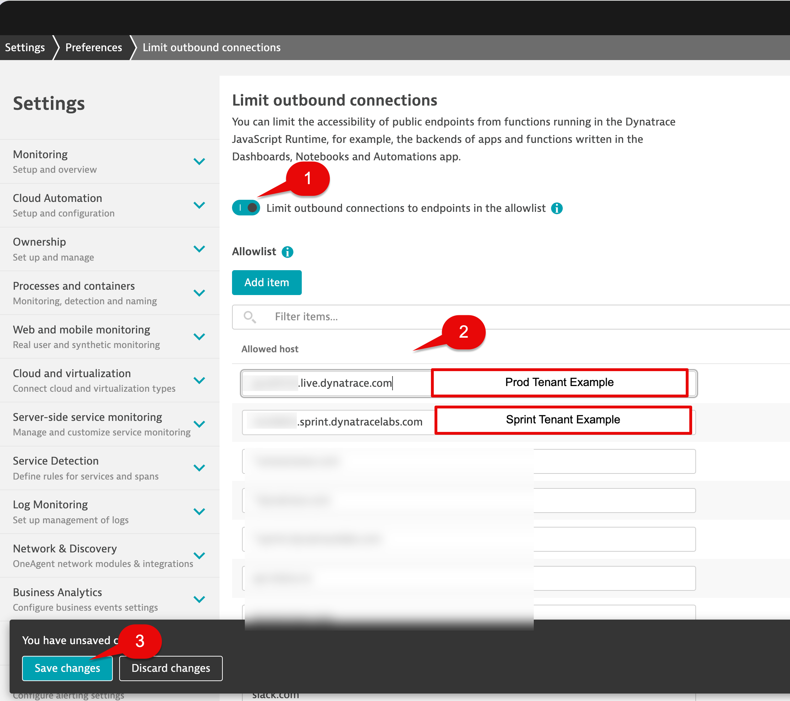
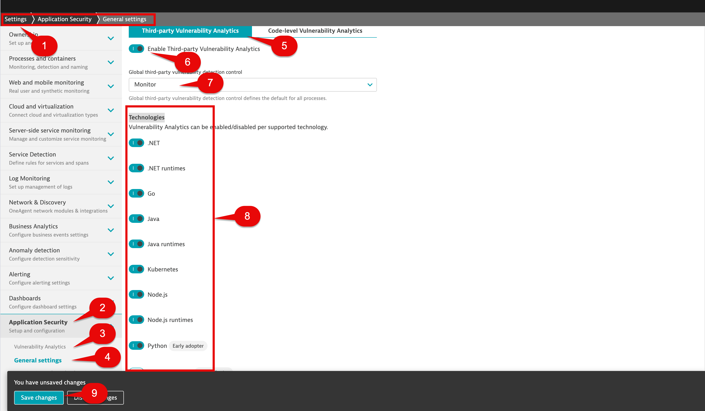
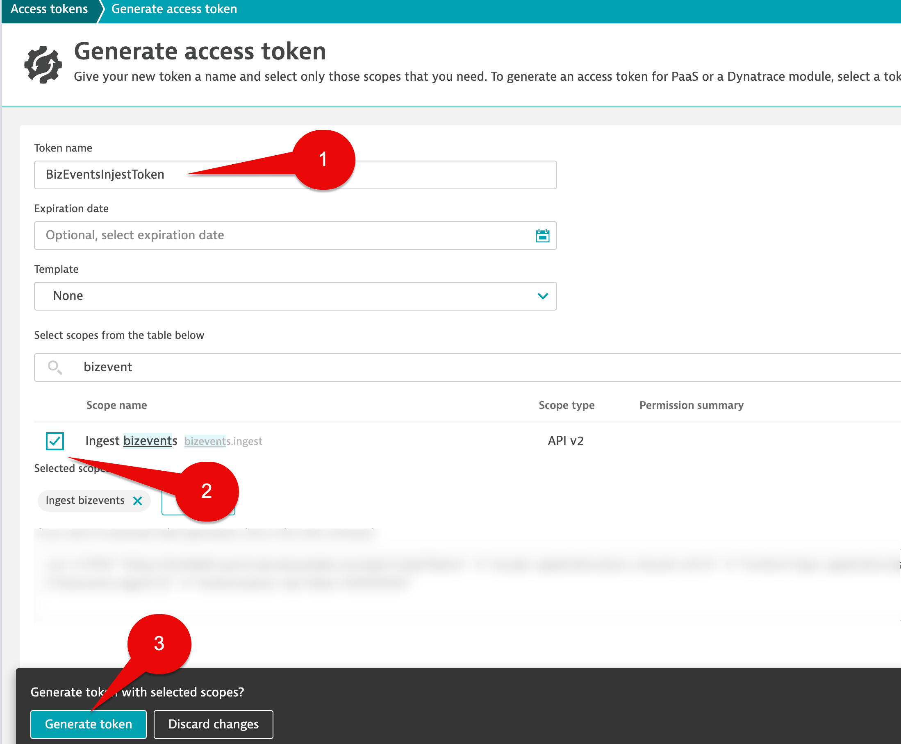
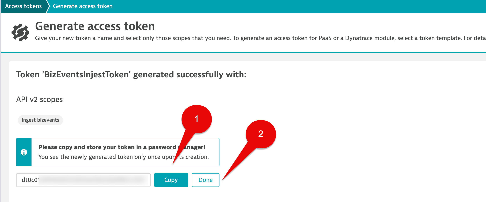

## Dynatrace Tenant Setup

You will need a Dynatrace SaaS tenant.

### Identify Dynatrace SaaS Tenant

Make a note of the Dynatrace environment name. This is the first part of the URL. `abc123` would be the environment ID for `https://abc123.apps.dynatrace.com`. 

When you copy the url for the tenant, please enter it without the 'apps' part, see examples below: 

```txt
Production -> https://abc123.live.dynatrace.com 

Sprint -> https://abc123.sprint.dynatracelabs.com 
```

For example, if you are using a Dynatrace production tenant it will look like this below,  where abc123 would be your your-environment-id.

```txt
https://abc123.live.dynatrace.com
```

⚠️ Again, no apps in the URL! ⚠️

⚠️ Make sure there is no trailing / at the end of the url ⚠️

### Enable Node.js Business Event OneAgent Feature

Open the `Settings Classic` App.

In the tree select `Preferences`, then `OneAgent features`.


Filter by:

```txt
Node.js Business Events
```

Select the sliders to enabled:

```txt
Node.js Business Events [Opt-In]
```

```txt
Instrumentation enabled (change needs a process restart)
```

Select the `Save changes` button at the bottom left of the screen.


### Enable OpenTelemetry OneAgent Features

Open the `Settings Classic` App.

In the tree select `Preferences`, then `OneAgent features`.


In the Filter by section, use below and hit return.

```txt
opentel
```

Enable all,  then expand the Details for each and make sure that second Enabled button is also selected where applicable.

When done, select the `Save changes` button.



### Enable Log Ingestion

Open the `Settings Classic` App.

In the tree select `Log Monitoring`, then `Log ingest rules`.

Make sure the `[Built-in] Ingest all logs` rule is enabled.



### Enable Limit Outbound Connections

During the hands on exercise we will use a Dynatrace Workflow to post data back to your tenanat via the Business Event API.  To do this we need to enable outbound connections for your tenant.

Open the `Settings Classic` App.

In the tree select `Preferences`, then `Limit outbound connections`.

Make sure the `Limit outbound connections to endpoints in the allow list` is enabled.

In the allow list section your tenant info as shown in below examples:

```txt
Production -> abc123.live.dynatrace.com 

Sprint -> abc123.sprint.dynatracelabs.com 
```

For example, if you are using a Dynatrace production tenant it will look like this below,  where abc123 would be your your-environment-id.

```txt
abc123.live.dynatrace.com
```

Select the Save changes button at the bottom left of the screen.



### Enable Third-party Vulnerability Analytics

Open the `Settings Classic` App.

In the tree select `Preferences`, then `Application Security`.  then `Vulnerability Analytics`, then `General` settings.

In `Third-party Vulnerability Analytics` tab, select `Enable Third-party Vulnerability Analytics` slider.

In the `Global third-party vulnerability detection control` section make sure `Monitor` is selected in the drop-down list.

In the `Technologies` section,  enable all technologies.

Select the Save changes button at the bottom left of the screen.



### Get the Operator Token and the Ingest Token from the Kubernetes App

Open the `Kubernetes` App.

Select the + Add cluster button.


Scroll down to the section `Install Dynatrace Operator`. 

Select the `Generate token` button for the `Dynatrace Operator`. Copy and save it to your Notepad.

Select the `Generate token` button for the `Data Ingest Token`.  Copy and save it to your Notepad.


You can close the Kubernetes App, we don't need it, we just needed the tokens.

### Create DT Business Event Token

Open the `Access tokens` classic app.

Select the `Generate new token` button.


In the `Token name` section provide a name.

In the `Select scopes from the table below` section find and select the checkbox for:

```txt
Ingest bizevents
```
Select the `Generate token` button at the bottom left of the page.



In the next screen, select the `Copy` button and save the token to your notepad as we will use this later.

Select the `Done` button.



### Conclusion

We have enabled Dynatrace tenant configurations for the following:

```txt
1. OneAgent Feature for Node.js Business Events
2. OneAgent Features for OpenTelemetry
3. Logs ingestion rule [Built-in] Ingest all logs
4. Limit outbound connections to endpoints
5. Third-party Vulnerability Analytics
```
You should now have 4 pieces of information:

```txt
1. A DT environment URL (DT_TENANT)
2. A Dynatrace Operator Token (DT_OPERATOR_TOKEN)
3. A Data Ingest Token (DT_INGEST_TOKEN)
4. An API token with permission for Business Events
```

We are now ready to move to the GitHub Repository and Code Spaces setup for this lab.