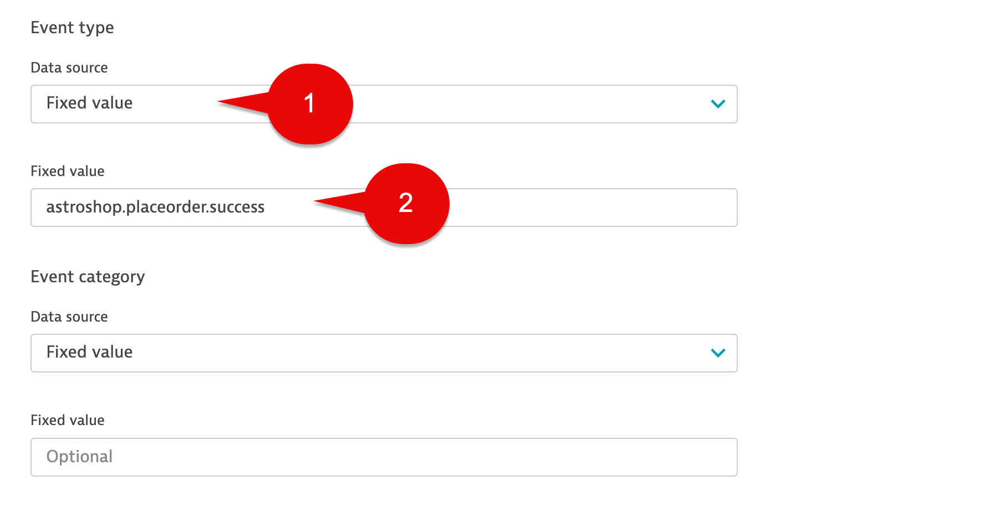
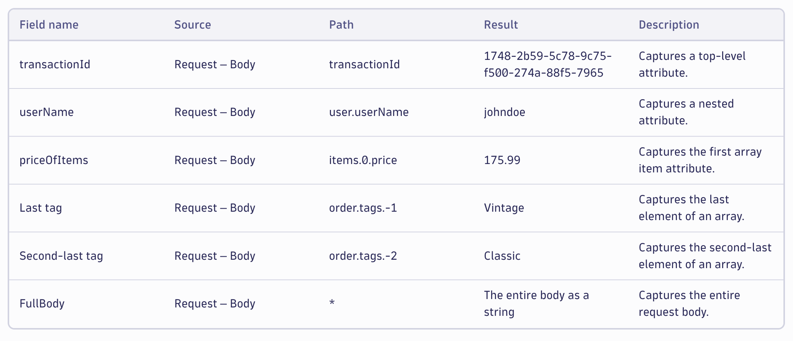
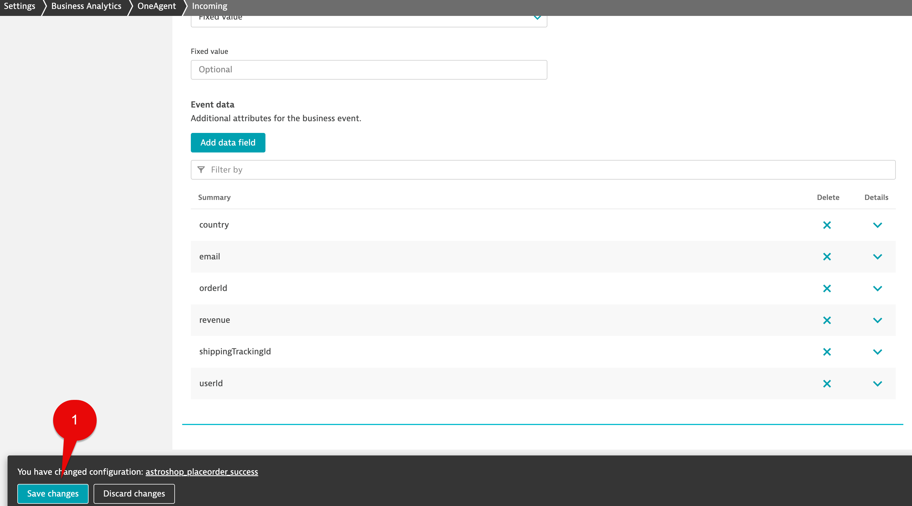

## Place Order

In this section of the lab we will configure a Business Event capture rule for `Place Order` step of the `Order to Shipped` business process.

### Business Event - Source Settings

1. Go to Settings Classic > Business Analytics > OneAgent Business Event Sources

2. Select the Incoming tab


### Business Event - Capture Rule

Select the Add new capture rule button and name your rule using the following name: 

```text
astroshop_placeorder_success
```


### Business Event - Triggers

To capture Business Events from incoming web requests, we need to define conditions which are called Triggers.  Triggers are connected by AND logic per capture rule. If you set multiple trigger rules, all of them need to be fulfilled to capture a business event.

We will use 3 triggers:

**Trigger 1**

Select the Add trigger button

In the `Data source` drop down list select:  

```text
Request - Path
```

In the `Operator` drop down list select: 

```text
equals
```

In the `Value` field use: 

```text
/api/checkout
```


**Trigger 2**

Select the Add trigger button

In the `Data source` drop down list select:  

```text
Response - Body
```

In the `Path` field use: 

```text
orderId
```

In the `Operator` drop down list select: 

```text
exists
```


**Trigger 3**

Select the Add trigger button

In the `Data source` drop down list select:  

```text
Response - HTTP Status Code
```

In the `Operator` drop down list select: 

```text
equals
```

In the `Value` field use: 

```text
200
```


### Business Event - Event Provider

The `Event Provider` is the source of the event, for example, the name of the component or system that generated the event.

Under Event meta data, for the Event provider section use the following:

In the `Data source` drop down list select:

```text
Fixed value
```

In the `Fixed value` section use:

```text
astroshop
```


### Business Event - Event Type

The Event Type is the unique identifier of a given event.

Under Event meta data, for the Event type section use the following:

In the `Data source` drop down list select:

```text
Fixed value
```

In the `Fixed value` section use:

```text
astroshop.placeorder.success
```



The `Event Category` is optional.  For this lab we will leave the defaults.

### Business Event - Event Meta Data

The steps so far concludes the configuration of a business event that will be generated each time the trigger criteria are matched. This might be sufficient if all you need is to count the number of matching events for example, to answer the question of how many `astroshop_placeorder_success` were made. 

In most cases, however, you will want to add event attributes for more granular insight. `Attributes` are data fields extracted from the event `JSON` or `XML` payload.

Below is sample response payload for the `Place Order` transaction.  The following steps will cover how to extract the `orderId` and `shippingTrackingId` from the response payload.   Capturing the `orderId` is critical for this business process as it will be unique identifier (correlation ID) that is common to all process steps.

**Note:** Use must use exact letter casing for fields that you define for data extraction. 

```json
{
    "orderId": "09766d7d-0530-11f0-895b-0e326b3139ca",
    "shippingTrackingId": "c51af8bd-3fe1-4a46-9d9b-45a16cd7cd66",
    "shippingCost": {
        "currencyCode": "USD",
        "units": 47,
        "nanos": 700000000
    },
    "shippingAddress": {
        "streetAddress": "1600 Amphitheatre Parkway",
        "city": "Mountain View",
        "state": "CA",
        "country": "United States",
        "zipCode": "94043"
    },
    "items": [
        {
            "cost": {
                "currencyCode": "USD",
                "units": 349,
                "nanos": 949999999
            },
            "item": {
                "productId": "66VCHSJNUP",
                "quantity": 1,
                "product": {
                    "id": "66VCHSJNUP",
                    "name": "Starsense Explorer Refractor Telescope",
                    "description": "The first telescope that uses your smartphone to analyze the night sky and calculate its position in real time. StarSense Explorer is ideal for beginners thanks to the app’s user-friendly interface and detailed tutorials. It’s like having your own personal tour guide of the night sky",
                    "picture": "StarsenseExplorer.jpg",
                    "priceUsd": {
                        "currencyCode": "USD",
                        "units": 349,
                        "nanos": 950000000
                    },
                    "categories": [
                        "telescopes"
                    ]
                }
            }
        }
    ]
}
```

Below is sample response payload for the `Place Order` transaction.  The following steps will cover how to extract the `userId` and `email` from the response payload. 

**Note:** Use must use exact letter casing for fields that you define for data extraction.

```json
{
        "userId": "2e31768f-dc87-4a74-b70f-5972ecca30b1",
        "email": "mark@example.com",
        "address": {
          "streetAddress": "1 Hacker Way",
          "state": "CA",
          "country": "United States",
          "city": "Menlo Park",
          "zipCode": "94025"
        },
        "userCurrency": "USD",
        "creditCard": {
          "creditCardCvv": "***",
          "creditCardExpirationMonth": "*",
          "creditCardExpirationYear": "****",
          "creditCardNumber": "****-****-****-****"
        }
}
```
 
The following table shows additional examples of how to extract data from JSON payloads.



[Dynatrace Documentation Link](https://docs.dynatrace.com/docs/shortlink/ba-business-events-capturing#json)

### Business Event - oderId Capture

Under the Event data section, select the Add data field button

In the `Field name` section use: 

```text
orderId
```

In the `Data Source` drop down list select:

```text
Response - Body
```

In the `Path` section use:

```text
orderId
```


### Business Event - shippingTrackingId Capture

Under the Event data section, select the Add data field button

In the `Field name` section use: 

```text
shippingTrackingId
```

In the `Data Source` drop down list select:

```text
Response - Body
```

In the `Path` section use:

```text
shippingTrackingId
```


### Business Event - userId Capture

Under the Event data section, select the Add data field button

In the `Field name` section use: 

```text
userId
```

In the `Data Source` drop down list select:

```text
Request - Body
```

In the `Path` section use:

```text
userId
```


### Business Event - revenue Capture

Under the Event data section, select the Add data field button

In the `Field name` section use: 

```text
revenue
```

In the `Data Source` drop down list select:

```text
Request - Body
```

In the `Path` section use:

```text
items.0.cost.units
```


### Business Event - Save Rule

Click the Save changes button



We have completed the Business Event capture for `Place Order Success` step  of the `Order to Shipped` business process.  In the next section we will validate the data using the `Notebook's App`.