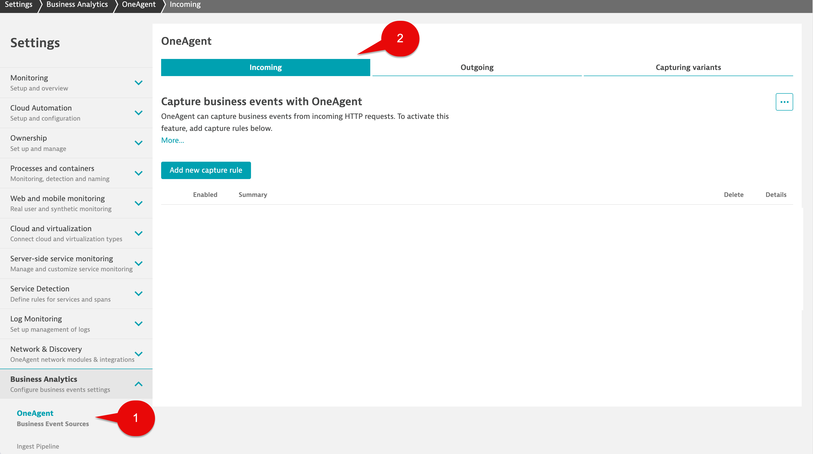
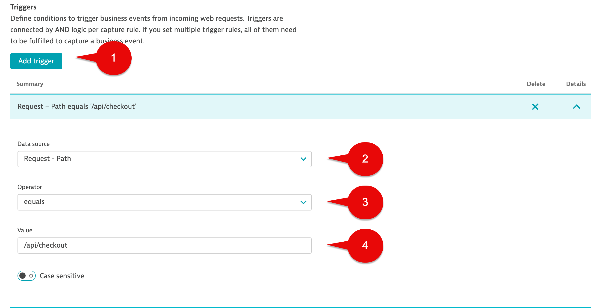
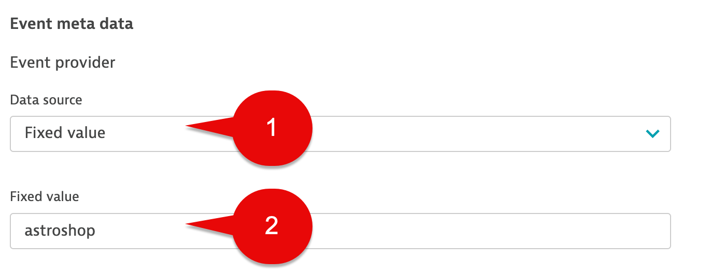

## Place Order Success

In this section of the lab we will configure Business Event capture for `Placer Order Success` step  of the `Order to Shipped` business process.

#### 1. Go to Settings Classic > Business Analytics > OneAgent Business Event Sources

#### 2. Select the Incoming tab



#### 3. Select the Add new capture rule button and name your rule using the following name: 

`astroshop_placeorder_success`


To capture business events from incoming web requests, we need to define conditions which are called Triggers.  Triggers are connected by AND logic per capture rule. If you set multiple trigger rules, all of them need to be fulfilled to capture a business event.

#### 4. Select the Add trigger button to define a condition that will trigger a business event

We will use 3 triggers:

**Trigger 1**

In the `Data source` drop down list select:  

`Request - Path`

In the `Operator` drop down list select: 

`equals`

In the `Value` field use: 

`/api/checkout`



**Trigger 2**

In the `Data source` drop down list select:  

`Response - Body`

In the `Path` field use: 

`orderId`

In the `Operator` drop down list select: 

`exists`


**Trigger 3**

In the `Data source` drop down list select:  

`Response - HTTP Status Code`

In the `Operator` drop down list select: 

`equals`

In the `Value` field use: 

`200`


#### 5. Under Event meta data, for the Event provider section use the following:

In the `Data source` drop down list select:

`Fixed value`

In the `Fixed value` section use:

`astroshop`



#### 6. Under Event meta data, for the Event type section use the following:

In the `Data source` drop down list select:

`Fixed value`

In the `Fixed value` section use:

`astroshop.placeorder.success`


The `Event Category` is optional.  For this lab we will leave the defaults.

The steps so far concludes the configuration of a business event that will be generated each time the trigger criteria are matched. This might be sufficient if all you need is to count the number of matching events for example, to answer the question of how many `astroshop_placeorder_success` were made. 

In most cases, however, you will want to add event attributes for more granular insight. `Attributes` are data fields extracted from the event `JSON` or `XML` payload.

Below is sample response payload for the `Place Order` transaction.  The following steps will cover how to extract the `orderId` and `shippingTrackingId` from the response payload.   Capturing the `orderId` is critical for this business process as it will be unique identifier (correlation ID) that is common to all process steps.

**Note:** Use must use exact letter casing for fields that you define for data extraction. 

```json
{
    "orderId": "09766d7d-0530-11f0-895b-0e326b3139ca",
    "shippingTrackingId": "c51af8bd-3fe1-4a46-9d9b-45a16cd7cd66",
    "shippingCost": {
        "currencyCode": "USD",
        "units": 47,
        "nanos": 700000000
    },
    "shippingAddress": {
        "streetAddress": "1600 Amphitheatre Parkway",
        "city": "Mountain View",
        "state": "CA",
        "country": "United States",
        "zipCode": "94043"
    },
    "items": [
        {
            "cost": {
                "currencyCode": "USD",
                "units": 349,
                "nanos": 949999999
            },
            "item": {
                "productId": "66VCHSJNUP",
                "quantity": 1,
                "product": {
                    "id": "66VCHSJNUP",
                    "name": "Starsense Explorer Refractor Telescope",
                    "description": "The first telescope that uses your smartphone to analyze the night sky and calculate its position in real time. StarSense Explorer is ideal for beginners thanks to the app’s user-friendly interface and detailed tutorials. It’s like having your own personal tour guide of the night sky",
                    "picture": "StarsenseExplorer.jpg",
                    "priceUsd": {
                        "currencyCode": "USD",
                        "units": 349,
                        "nanos": 950000000
                    },
                    "categories": [
                        "telescopes"
                    ]
                }
            }
        }
    ]
}
```

Below is sample response payload for the `Place Order` transaction.  The following steps will cover how to extract the `userId` and `email` from the response payload. 

**Note:** Use must use exact letter casing for fields that you define for data extraction.

```json
{
        "userId": "2e31768f-dc87-4a74-b70f-5972ecca30b1",
        "email": "mark@example.com",
        "address": {
          "streetAddress": "1 Hacker Way",
          "state": "CA",
          "country": "United States",
          "city": "Menlo Park",
          "zipCode": "94025"
        },
        "userCurrency": "USD",
        "creditCard": {
          "creditCardCvv": "***",
          "creditCardExpirationMonth": "*",
          "creditCardExpirationYear": "****",
          "creditCardNumber": "****-****-****-****"
        }
}
```
 
The following table shows additional examples of how to extract data from JSON payloads.


[Dynatrace Documentation Link](https://docs.dynatrace.com/docs/shortlink/ba-business-events-capturing#json)

#### 7. Under the Event data section, select the Add data field button.

In the `Field name` section use: 

`orderId`

In the `Data Source` drop down list select:

`Response - Body`

In the `Path` section use:

`orderId`


#### 8. Under the Event data section, select the Add data field button.

In the `Field name` section use: 

`shippingTrackingId`

In the `Data Source` drop down list select:

`Response - Body`

In the `Path` section use:

`shippingTrackingId`


#### 9. Under the Event data section, select the Add data field button.

In the `Field name` section use: 

`userId`

In the `Data Source` drop down list select:

`Request - Body`

In the `Path` section use:

`userId`


#### 10. Under the Event data section, select the Add data field button.

In the `Field name` section use: 

`email`

In the `Data Source` drop down list select:

`Request - Body`

In the `Path` section use:

`email`


#### 11. Click the Save changes button.


We have completed the Business Event capture for `Placer Order Success` step  of the `Order to Shipped` business process.  In the next section we will validate the data using the `Notebook's App`.