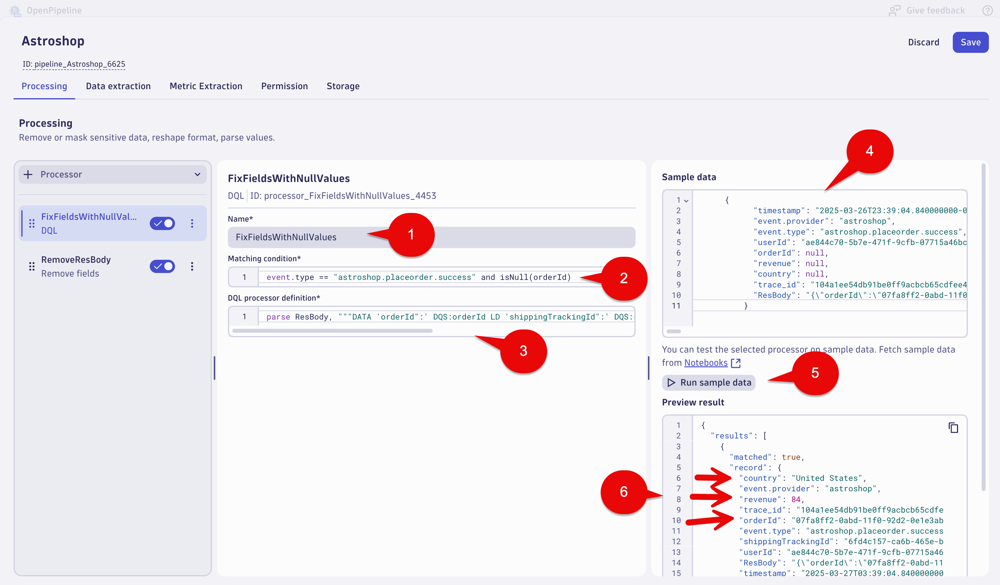
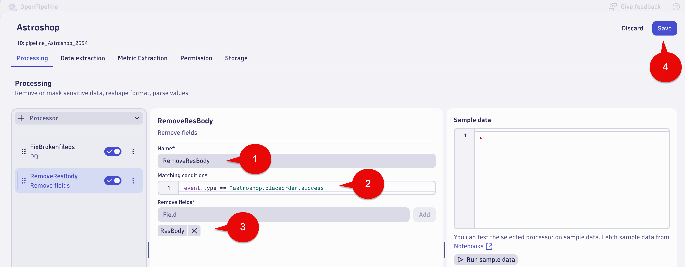

## OpenPipeline

In this section of the lab we will use OpenPipeline to replace the  `orderId`, `revenue`, `country` fields values when they are null. Using OpenPipeline, the `ResBdy` field will be used to extract the correct values needed for the `Place Order` Business Event.

## Business Events - OpenPipeline - Place Order

1. Launch the OpenPipeline app

2. Select `Business events` in the OpenPipeline tree

3. Select `Pipelines` tab

4. Select the `+ Pipeline` button


## Business Events - OpenPipeline - Processing - Place Order

1. Name your OpenPipeline rule using the following name: 

```text
Astroshop
```

2. Select the `Processing` tab

3. Select the `+ Processor` button (left side of the screen), then select `DQL`


4. Fill out the fields with the following data:

Name: 

```text
FixFieldsWithNullValues
```

Matching condition: 

```text
event.type == "astroshop.placeorder.success" and isNull(orderId)
```

DQL processor definition: 

```txt
parse ResBody, """DATA 'orderId":' DQS:orderId LD 'shippingTrackingId":' DQS:shippingTrackingId LD 'units":' DOUBLE:revenue LD  LD 'country":' DQS:country"""
```

Sample data:

```json

     {
           "timestamp": "2025-03-26T23:39:04.840000000-04:00",
           "event.provider": "astroshop",
           "event.type": "astroshop.placeorder.success",
           "userId": "ae844c70-5b7e-471f-9cfb-07715a46bc8d",
           "orderId": null,
           "revenue": null,
           "country": null,
           "trace_id": "104a1ee54db91be0ff9acbcb65cdfee4",
           "ResBody": "{\"orderId\":\"07fa8ff2-0abd-11f0-92d2-0e1e3ab12988\",\"shippingTrackingId\":\"6fd4c157-ca6b-465e-bc39-a5096d6ee08c\",\"shippingCost\":{\"currencyCode\":\"USD\",\"units\":84,\"nanos\":400000000},\"shippingAddress\":{\"streetAddress\":\"1 Hacker Way\",\"city\":\"Menlo Park\",\"state\":\"CA\",\"country\":\"United States\",\"zipCode\":\"94025\"},\"items\":[{\"cost\":{\"currencyCode\":\"USD\",\"units\":209,\"nanos\":949999999},\"item\":{\"productId\":\"2ZYFJ3GM2N\",\"quantity\":2,\"product\":{\"id\":\"2ZYFJ3GM2N\",\"name\":\"Roof Binoculars\",\"description\":\"This versatile, all-around binocular is a great choice for the trail, the stadium, the arena, or just about anywhere you want a close-up view of the action without sacrificing brightness or detail. It\u0019s an especially great companion for nature observation and bird watching, with ED glass that helps you spot the subtlest field markings and a close focus of just 6.5 feet.\",\"picture\":\"RoofBinoculars.jpg\",\"priceUsd\":{\"currencyCode\":\"USD\",\"units\":209,\"nanos\":950000000},\"categories\":[\"binoculars\"]}}}]}"
         }
     
```

5. Select the `Run sample data` button

6. Under the `Preview result` section validate `orderId`, `country` and `revenue` fields have values.



## Business Events - OpenPipeline - Processing - Remove ResBody Field

1. Select the `+ Processor` button (left side of the screen), then select `Remove fields`


2. Fill out the fields with the following data:

Name: 

```text
RemoveResBody
```

Matching condition: 

```text
event.type == "astroshop.placeorder.success"
```

Remove fields:

After adding the below field to remove, select the Add button

```text
ResBody
```

3. Select the Save Button at the top right of the screen



## Business Events - OpenPipeline Dynamic Route - Place Order

Now we need to create a Dynamic route for the Astroshop Business Events pipeline. Dynamic routes give you the option to route your ingested data into a pipeline with a matching condition.

1. Select `Business events` in the OpenPipeline tree 

2. Select `Dynamic routing` tab

3. Select `+ Dynamic route` button


4. Configure the Dynamic route with the following

Name:

```text
Astroshop_BusinessEvents
```

Matching condition:

```text
event.provider == "astroshop"
```

Pipeline:

In the dropdown list select the following

```text
Astroshop
```

4. Select the `Add` button


5.  Select the `Save` button

```text
A warning icon with this message will appear "Do you want to save your changes to this table?" 
```
Select the `Save` button


### Conclusion

We have completed the Business Event OpenPipeline section for `Place Order` step of the `Order to Shipped` business process.  This section covered how to use OpenPipeline to replace the null values  for `orderId`, `revenue`, `country` with the correct values.  The next section will validate the data.