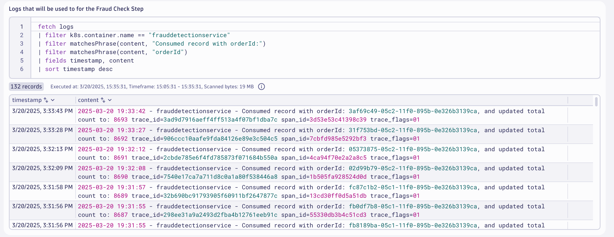
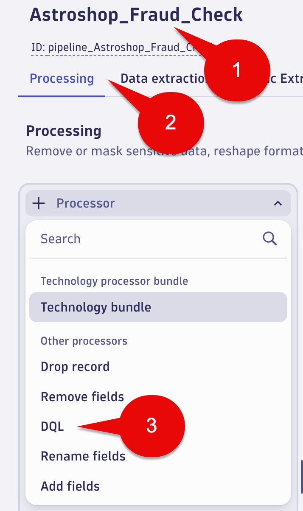
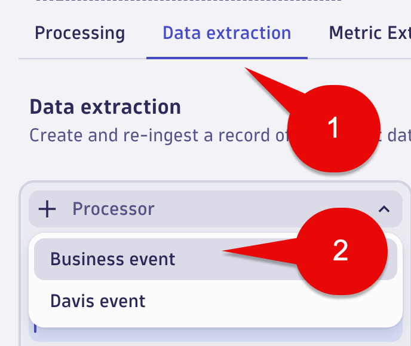
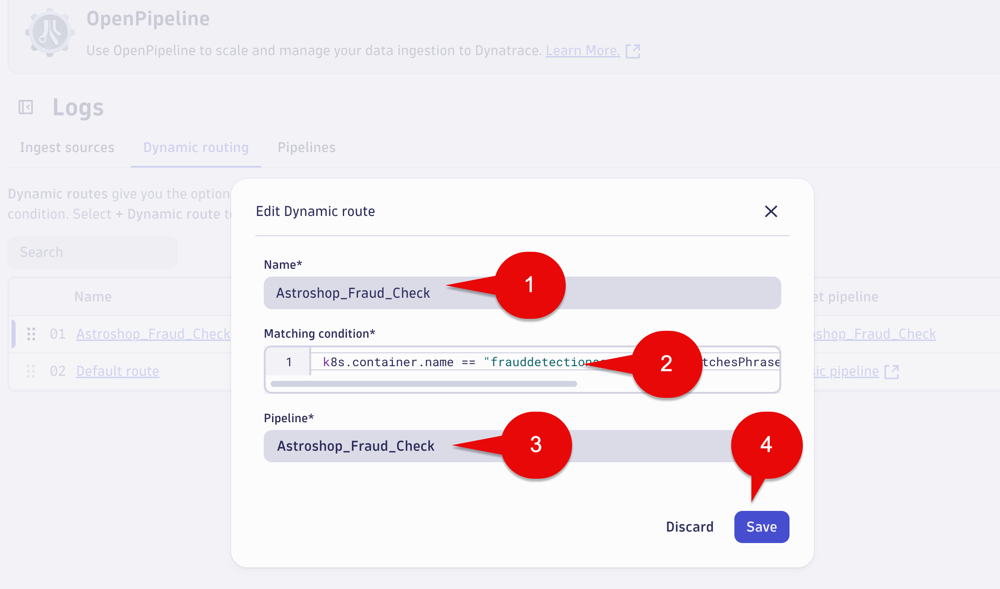

## Fraud Check

In this section of the lab we will use OpenPipeline to convert incoming logs to business events for the `Fraud Detection` step of the `Order to Shipped` business process. 

### Logs - Fraud Check

Using a Notebook execute the below DQL query which retrieves the log lines that will be converted into business events for the `Fraud Check` step of the `Order to Shipped` business process.

DQL:
```sql
fetch logs
| filter k8s.container.name == "frauddetectionservice"
| filter matchesPhrase(content, "Consumed record with orderId:")
| filter matchesPhrase(content, "orderId")
| fields timestamp, content
| sort timestamp desc
```

Result:



## Logs - Fraud Check orderID Extraction

Using a Notebook execute the below DQL query which retrieves the log lines that will be converted into business events for the `Fraud Check` step of the `Order to Shipped` business process.  We will parse the logs lines to extract the orderId. 

DQL:
```sql
fetch logs
| filter k8s.container.name == "frauddetectionservice"
| filter matchesPhrase(content, "Consumed record with orderId:")
| parse content, """DATA 'Consumed record with orderId: ' ld:orderId ','"""
| fields timestamp, orderId, content
| sort timestamp desc
```
Result:


## Business Event - OpenPipeline - Fraud Check

Launch the OpenPipeline app.

Select Logs in the tree. 

Select the Pipelines tab.

Select the + Pipeline button.


## Business Event - OpenPipeline Processing - Fraud Check

Name your OpenPipeline rule using the following name: 

```text
Astroshop_Fraud_Check
```

Select the `Processing` tab

Select the `+ Processor` button (left side of the screen), then select DQL



Fill out the fields with the following data:

Name: 

```text
FraudCheckBizEventFromLog
```

Matching condition: 

```text
k8s.container.name == "frauddetectionservice" AND matchesPhrase(content, "Consumed record with orderId:")
```

DQL processor definition: 

```text
parse content, """DATA 'Consumed record with orderId: ' ld:orderId ','"""
| fieldsAdd add1second = toTimestamp(toLong(timestamp) + 1000000000)
| fieldsAdd timestamp = add1second
```

In the sample data section use the following:

```json
{
      "timestamp": "2025-03-19T13:41:16.000000000-04:00",
      "content": "2025-03-19 17:41:16 - frauddetectionservice - Consumed record with orderId: 5ba0f19d-04e9-11f0-895b-0e326b3139ca, and updated total count to: 1126 trace_id=6cd0e9c60fd10799c66eb344f916d7e6 span_id=3173a5d07a507a1d trace_flags=01 ",
      "k8s.container.name": "frauddetectionservice"
}
```
Select the `Run sample data` button and Preview the results.  

Validate the orderId field exists in the results.


## Business Event - OpenPipeline Data extraction - Fraud Check

Select the `Data extraction` tab.

Select the `+ Processor` button (left side of the screen), then select Business event.



Fill out the fields with the following data:

Name:

```text
orderId
```

Matching condition:

```text
k8s.container.name == "frauddetectionservice" AND matchesPhrase(content, "Consumed record with orderId:") and isNotNull(orderId)
```

Event type:

Select the Static string radio button and use the following:

```text
astroshop.fraudcheck.success
```

Event provider:

Select the Static string radio button and use the following:

```text
astroshop
```

Field extraction: 

Select the Fields to extract radio button.  We will add 3 fields to extract (keep).  The fields need to be added independently.

Click the Add button for:

```text
timestamp
```

Click the Add button for:

```text
orderId
```
Click the Add button for:

```text
trace_id
```

Select the Save Button at the top right of the screen.


## Business Event - OpenPipeline Dynamic Route - Fraud Check

Now we need to create a Dynamic route for the `Astroshop_Fraud_Check` pipeline. 

Dynamic routes give you the option to route your ingested data into a pipeline with a matching condition.

In the OpenPipeline App, select Logs in the tree.

Select the Dynamic routing tab.

Select `+ Dynamic route` button.


Configure the Dynamic route with the following:

Name:

```text
Astroshop_Fraud_Check
```

Matching condition:

```text
k8s.container.name == "frauddetectionservice" AND matchesPhrase(content, "Consumed record with orderId:")
```

Pipeline:

In the dropdown list select the following

```text
Astroshop_Fraud_Check
```

Select Add button.



Select Save button.

A warning icon with this message will appear "Do you want to save your changes to this table?" 

Select the Save button.


### Conclusion

We have completed the Business Event capture using log lines and OpenPipeline for `Fraud Check` step of the `Order to Shipped` business process.  The next section will validate the data.