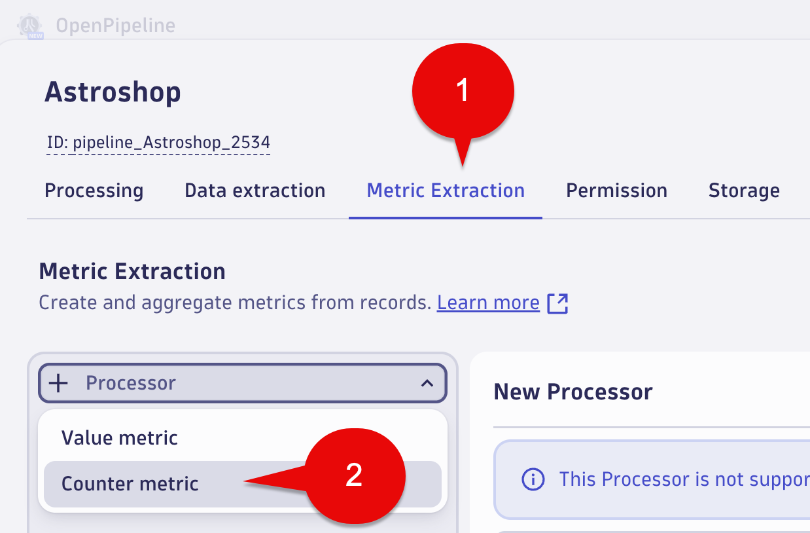

## Place Order Metric

In this section of the lab we will create a counter metric for `Place Order` step.  We also want to report by Country.

## Business Metric - OpenPipeline - Place Order

Launch the OpenPipeline app.

Select `Business events` in the OpenPipeline tree.

Select `Pipelines` tab.

Select the `Astroshop` Pipeline.


## Business Metric - OpenPipeline Processing - Place Order

Select the `Metric Extraction` tab.

Select the `+ Processor` button (left side of the screen), then select `Counter metric`



`Note`: 

* `Counter metric` 

```text
Where you want to count the number `Place Order` occurrences.
```

* `Value metric` 

```text
Where you want to report on `Revenue`. The revenue field captured in the `Place Order` 
Business Event data values would be extracted and used as the metric value. 
```

Fill out the fields with the following data:

Name: 

```text
OrderShippedSucccess
```

Matching condition: 

```text
event.provider == "astroshop" and event.type == "astroshop.placeorder.success"
```

Metric key: 

```text
astroshop.placeorder.success
```

Dimensions: 

Select the Custom radio button.

For the `Field name on record` and `Dimension name` sections use:

```text
country
```

Click the `Add dimension` button.  This will add both fields. 

Select the Save button at the top right of the screen.


### Conclusion

We have completed the Business Metric capture for `Placer Order` step  of the `Order to Shipped` business process. The next section will validate the data.